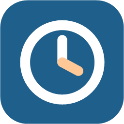

# Zeiterfassung

Windows-App zur täglichen Stundenerfassung (Montag bis Freitag) mit Excel-Auswertung per Outlook.



## Download

Die aktuelle Version gibt es unter **[Releases](../../releases/latest)**: `Zeiterfassung.exe` herunterladen und starten. Es wird nichts weiter benötigt (.NET ist enthalten).

> Beim ersten Start kann Windows SmartScreen warnen, weil die Datei nicht signiert ist: „Weitere Informationen“ → „Trotzdem ausführen“.

## Funktionen

- Wochenleiste Mo–Fr mit Tages- und Wochensummen, KW nach ISO 8601
- Eintrag pro Kunde mit Zeitaufwand (15-Minuten-Schritte) und Tätigkeit
- Einträge nachträglich ändern oder löschen (Kunde, Zeit, Tätigkeit)
- Tagesübersicht und Wochenübersicht mit Summe je Kunde
- Kunden verwalten: Umbenennen ändert den Namen in allen Einträgen
- Auswertung für einen Tag oder eine Woche als Excel-Datei (.xlsx)
- **Per Outlook senden**: Mail mit Empfänger, Betreff, Text und Excel-Anhang wird fertig geöffnet (oder auf Wunsch direkt gesendet)
- Datensicherung als JSON, kompatibel mit der iPhone-Version ([zeiterfassung-ac](https://github.com/PolluxBo/zeiterfassung-ac))

Tastatur: `Strg+S` speichert den Eintrag, `Esc` bricht das Bearbeiten ab.

## Speicherorte

| Was | Wo |
| --- | --- |
| Daten | `%APPDATA%\Zeiterfassung\daten.json` |
| Excel-Auswertungen | `Downloads\Zeiterfassung\` |

## Entwicklung

Voraussetzung: .NET 8 SDK.

```bash
dotnet run --project src/Zeiterfassung
```

Einzeldatei bauen:

```bash
dotnet publish src/Zeiterfassung -c Release -r win-x64 --self-contained true -p:PublishSingleFile=true -p:IncludeNativeLibrariesForSelfExtract=true -p:EnableCompressionInSingleFile=true -o publish
```

Ein Tag `v*` (z. B. `v1.0.1`) baut über GitHub Actions automatisch ein Release mit der `.exe`.

Excel-Export mit [ClosedXML](https://github.com/ClosedXML/ClosedXML) (MIT).

## Hinweis zu Windows-Sicherheit

Ist der **Überwachte Ordnerzugriff** (Ransomware-Schutz) aktiv, blockiert Windows das Schreiben unsignierter Programme in „Dokumente“, „Desktop“ und „Bilder“. Die App legt Auswertungen deshalb unter **Downloads\Zeiterfassung** ab. Wer trotzdem in „Dokumente“ speichern möchte, gibt die App frei unter *Windows-Sicherheit → Viren- & Bedrohungsschutz → Ransomware-Schutz → App durch überwachten Ordnerzugriff zulassen*.
